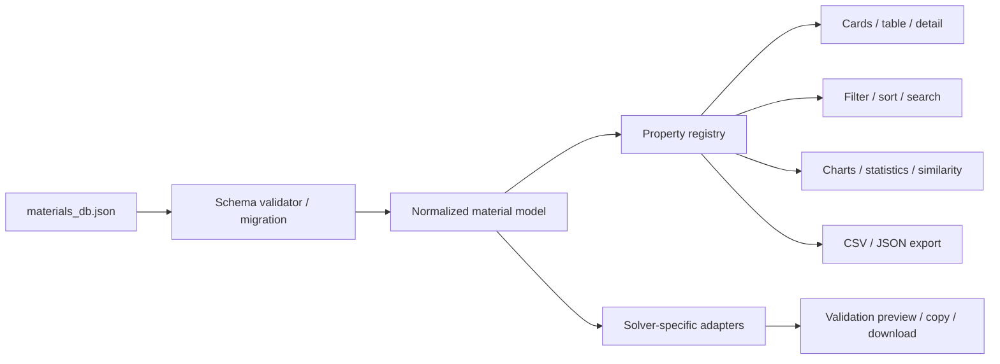

# コードレビュー・リファクタリング／追加機能提案

- レビュー日: 2026-07-16
- 対象コミット: `cf21f52`
- 対象: `index.html`、`css/style.css`、`js/*.js`、`materials_db.json`、`README.md`
- データ規模: 536材料、11カテゴリ、JSON 2,108,293 bytes（gzip 約211 KB）

## 結論

現在のアプリは、外部ライブラリなしの静的Webアプリとして、検索、比較、分析、単位切替、出典表示、ソルバー連携まで幅広く実装されています。一方、解析用途で結果を信頼する前に直すべき問題があります。

最優先は次の4項目です。

1. ソルバーカードが欠損値を `0` として出力し、データ内のマッピングや構成則を落とす。
2. 同じ物性フィールドに数値とobjectが混在し、特定材料の詳細表示が例外停止する。
3. URLの数値範囲キーを無制限に受け入れ、`Object.prototype` を汚染できる。
4. 表示・検索・分析ごとに物性アクセサが不統一で、実在するE・密度・強度が大量に欠落する。

この4項目を修正した後、単位系の統一、欠損値を誤解させない分析、アクセシビリティ、部分レンダリングを進めるのが妥当です。追加機能では、ソルバーカードの検証プレビュー、データ信頼度表示、制約ベースの材料選定、説明可能な類似検索が特に効果的です。

## 優先度

| 優先度 | 意味 |
|---|---|
| P0 | 誤った解析入力、画面停止、またはセキュリティ問題につながるため、先に修正する |
| P1 | 表示・分析の信頼性、操作性、保守性に大きく影響するため、次の改修で対応する |
| P2 | 規模拡大や継続利用に備えて計画的に対応する |

## P0: 先に修正すべき項目

### 1. ソルバーカードが欠損値をゼロ埋めし、マッピングを落とす

**対象**

- `js/features.js:131-165`（特に `142-161`）
- `js/app.js:1374-1447`
- `README.md:51-54`

**確認結果**

- 等方性経路では、E・ν・ρの欠損を `|| 0` で補っています。
- UIは `other.<solver>_mapping` の存在だけでコピーボタンを表示しますが、ジェネレータはマッピング本体の大半を利用せず、`linear_elastic` から別のカードを再構成します。
- 対応対象として認識できる弾性データ自体がない材料が87件、`linear_elastic` はあるがE・ν・ρのいずれかが標準キーにない材料が59件あり、合計146件でゼロ値を含むカードが生成され得ます。
- `linear_elastic` 282件の内訳では、標準キー上のE欠損が52件、密度欠損が58件、ν欠損が9件です。
- 実行確認では次の出力になりました。

```text
! Dense sand drained reference
MP,EX,1,0
MP,PRXY,1,0.35
MP,DENS,1,0

! MDF 115 interior panel reference
MP,EX,1,0
MP,PRXY,1,0
MP,DENS,1,0
```

MDFのマッピング内には `EX_pa: 1241000000` があるため、単なるデータ欠損ではなく、ジェネレータがマッピング形式を読めていない問題です。

さらに、Abaqusデータには `mapping.plastic` が27件ありますが、コードはデータ中に存在しない `mapping.plastic_table` を参照するため、塑性データが全件出力されません。ANSYSの板厚別 `tb_biso_variants_by_thickness_mm` 2件も出力対象外です。

READMEの「不足パラメータは0埋めせず、既知定数のみ出力する」という説明は、現在は直交異方性の一部経路にしか当てはまりません。

**推奨対応**

- 欠損値の `0` 補完を廃止し、必須値不足時はfail closedで出力を止める。
- ジェネレータの返却値を文字列から `{ text, warnings, errors, readiness, provenance }` に変える。
- ANSYS、Abaqus、DOLFINx、LS-DYNAごとに、対応するマッピング形式を読むアダプターを実装する。
- `linear_mp`、`isotropic_material_reference`、`elastic`、`plastic`、板厚別variant、超弾性等を構成則単位で明示的に扱う。
- コピー前に、採用モデル、単位、必須値、欠損値、推定値、出典をプレビューする。
- `complete / partial / reference_only / unsupported` のsolver readinessを算出またはデータに保持する。
- 全536材料×利用可能ソルバーのゴールデンテストを作り、「欠損を数値0として出力しない」ことを機械検査する。

### 2. 物性値の型混在で詳細表示が例外停止する

**対象**

- `materials_db.json:4747-4757`
- `js/app.js:1991-1999`
- `js/features.js:28-45`

**確認結果**

`titanium_ti6al4v_eli_mill_annealed` の `ultimate_tensile_strength_pa` は数値ではなく、次のobjectです。

```json
{
  "minimum_specified": 862000000,
  "typical": 896000000
}
```

詳細表示はこれをそのまま `formatStress()` に渡し、最終的に `value.toFixed()` を呼ぶため、`TypeError: value.toFixed is not a function` が発生します。

型混在が確認された主なパスは次の5種類です。

- `equivalent_youngs_modulus_pa`
- `elongation_percent`
- `lap_shear_strength_pa`
- `ultimate_tensile_strength_pa`
- `yield_strength_0p2_pa`

また、`strength_data` 配下には222種類のキーがあり、`_min` / `_minimum` 等の表記揺れもあります。フィールド名だけを見て数値と仮定する設計は、データ追加のたびに破綻しやすい状態です。

**推奨対応**

- 物性値を、例えば次のような正規形へ段階的に移行する。

```ts
type PropertyValue = {
  representative?: number;
  min?: number;
  max?: number;
  typical?: number;
  unit: string;
  condition?: string;
  sourceIds?: string[];
  quality?: "direct" | "derived" | "inferred" | "partial";
};
```

- 移行期間中は、scalar / range / typical / minimumを解決する共通アクセサを用意する。
- 数値フォーマッタの入口で `typeof value === "number" && Number.isFinite(value)` を必須にする。
- ロード時にJSON Schemaで型を検証し、不正レコードは材料IDとパスを示して報告する。
- 全材料の詳細パネルを一度ずつレンダリングする回帰テストを追加する。

### 3. URL範囲パラメータからprototype pollutionが可能

**対象**

- `js/app.js:516-542`

**確認結果**

範囲パラメータの物性キーを正規表現で取り出し、そのまま通常のobjectに代入しています。例えば次のURLキーでは、`rangeFilters["__proto__"].min` を介してアプリ実行realmの `Object.prototype.min` が設定されます。

```text
?r___proto___min=123
```

許可されていない物性名、`NaN`、`1abc` のような部分的な数値も受理されます。現状の画面だけで任意コード実行に直結するとは限りませんが、共有URLを開くだけでグローバルobjectの挙動を変えられるため修正が必要です。

**推奨対応**

- URLから受け入れるキーを `PROPERTY_DEFS` の明示的なallowlistに限定する。
- 状態格納には `Map` または `Object.create(null)` を使用する。
- `parseFloat()` ではなく `Number()` と `Number.isFinite()` で厳密検証する。
- `min <= max`、物性ごとの妥当範囲、SIへの変換後の有限値を確認する。
- 不正パラメータは状態へ入れず、正規化後のURLからも除去する。
- `__proto__`、`constructor`、`prototype`、NaN、Infinity、部分数値を含むURLテストを追加する。

### 4. 物性アクセサの不統一により、既存データが検索・表示・分析から欠落する

**対象**

- `js/features.js:5-21`
- `js/app.js:411-440`
- `js/app.js:988-1000`
- `js/app.js:1199-1210`
- `js/app.js:1587-1705`

**確認結果**

- `equivalent_youngs_modulus_pa` を持つ51材料（Wood 8、Soil 43）を共通アクセサが取得できません。
- `reference_density_kg_m3` を持つSoil 43材料を密度アクセサが取得できません。
- `yield_strength_0p2_pa` 12材料、`typical_yield_strength_pa` 2材料も代表降伏強度に使われません。
- グリッドカードは直交異方性Eとして `E_x_pa` を参照しますが、実データ167件は `EX_pa` または `E1_pa` で、`E_x_pa` は0件です。
- 直交異方性167件と等価E 51件の合計218材料は、Eを保持していてもグリッドカードにEが表示されません。
- SoilではE・密度が無視され、νだけが表示・類似検索に使われます。その結果、異なる土質材料がν=0.35だけで距離0、表示上100%類似になるケースがあります。
- せん断弾性率は現在の共通アクセサで明示値3件、体積弾性率は0件しか取得できない一方、分析軸として常時公開されています。

同じ「代表E」ロジックが `app.js` と `features.js` に重複し、カード、表、比較、CSV、チャート、類似検索、ソルバーカードが別々の規則で値を選んでいます。

**推奨対応**

- 物性ごとに、別名、型、代表値規則、単位変換、表示形式、導出式、品質を持つ一つのproperty registryへ統合する。
- 表示、検索、ソート、範囲フィルタ、比較、統計、CSV、類似度、ソルバー出力は必ず同じregistryを利用する。
- 導出値（例: Eとνから算出したG/K）は `derived` と式を表示し、直接値と混同しない。
- 物性ごとのデータ充足率を算出し、データが極端に少ない分析軸は非表示または警告付きにする。
- 「データ上に値があるのに、代表値アクセサがnullを返す材料が0件」であることをCIで検査する。

## P1: 次の改修で対応したい項目

### 5. 分析グラフの単位と欠損値表現が、一覧・比較と一致しない

**対象**

- `js/app.js:900-968`
- `js/app.js:1041-1130`
- `js/app.js:1450-1488`
- `js/app.js:1787-1812`
- `js/charts.js:20-337`

**確認結果**

- US単位に切り替えるとカードと範囲入力はpsi / lb/ft³になりますが、散布図、ヒストグラム、棒グラフにはraw SI値が渡されます。
- ローカル画面でUS表示中に散布図を開くと、軸名は「ヤング率 (E)」「密度 (ρ)」だけで単位がなく、目盛りはPa・kg/m³相当の値でした。
- 線形軸の余白により、正値しかない密度軸に負の目盛りも表示されます。
- 板厚チャートのY軸は単位切替にかかわらず常にPaです。
- 比較レーダーは欠損値を `0` とし、「データなし」を「全材料中の最小値」と同じ位置に描きます。
- 全DBの線形min-max正規化は外れ値の影響が強く、正規化方式や実値が利用者に示されません。

**推奨対応**

- property registryに `convertFromSI`、`displayUnit`、`formatAxis` を持たせる。
- グラフには表示単位へ変換済みの値と、単位付き軸ラベルを渡す。
- 正値物性はlog軸を既定候補とし、線形軸では物理的下限0へのclampを選べるようにする。
- レーダーの欠損軸はN/A、破線、未描画等で明示し、充足率と実値tooltipを表示する。
- 平均だけでなく、n/N、中央値、IQR、min-maxを表示する。
- 単位・言語切替時に、開いている分析パネルも再描画する。

### 6. 類似度が「一致率」に見えるが、比較根拠が不十分

**対象**

- `js/features.js:49-79`
- `js/app.js:1492-1517`

**確認結果**

比較可能な物性が1つでもあれば候補にし、候補ごとに異なる次元数で距離を算出します。欠損へのペナルティがないため、νだけ一致しても距離0になり得ます。UIは `(1 - distance) × 100` を `%` 表示するため、統計的に検証された一致率と誤解されやすいです。

**推奨対応**

- 最低共有次元数を設定し、満たさない候補は除外する。
- 「E・ρ・σy・νのうち3/4項目で比較」のように比較根拠を表示する。
- 欠損ペナルティ、log変換、robust scalingを導入する。
- カテゴリ、温度、製品形態、validation tierで候補を制約できるようにする。
- `%` ではなく「類似度スコア」とし、各物性の差分内訳を表示する。

### 7. チャートの未エスケープHTMLとCSV formula injection

**対象**

- `js/charts.js:109,129,179,241,297`
- `js/features.js:111-120`

**確認結果**

チャートのtooltipとlegendは、材料名、カテゴリ、データセット名を未エスケープのまま `innerHTML` に入れています。同梱JSONには問題のある文字列を検出していませんが、今後のデータ更新や外部データ取込でstored XSSになります。

CSVは引用符処理を行っていますが、`=`, `+`, `-`, `@` で始まるセルを表計算ソフトで開いた場合のformula injection対策がありません。

**推奨対応**

- tooltipとlegendを `createElement()` / `textContent` で構築する。
- 文字列の安全化責務をチャート呼び出し側ではなくChartsモジュール内へ集約する。
- CSVのテキスト列をformula-safeにし、Excel向けUTF-8 BOMを選択可能にする。
- HTMLを含む材料名・カテゴリ、数式開始文字を含むCSVセルの回帰テストを追加する。

### 8. キーボード・ダイアログ・モバイル操作のアクセシビリティ不足

**対象**

- `index.html:17-38,71-124`
- `js/app.js:742-875,972-1016,1189-1248,1499-1516`
- `js/app.js:1521-1563,1718-1868,2175-2200`
- `css/style.css:973-1083`

**確認結果**

- クリック可能なカテゴリ`li`、材料カード`div`、類似材料`div`、表`tr`、散布図`circle`をEnter/Spaceで操作できません。
- 536件表示時、カードは536、buttonは1,088、DOM elementは8,378でしたが、材料カード自体に`role`や`tabindex`はありません。
- お気に入り・比較ボタンのアクセシブル名は主に `☆` / `⇄` です。状態を示す `aria-pressed` もありません。
- detail / compare / analysis panelに `role="dialog"`、`aria-modal`、見出し関連付け、focus移動、focus trap、閉じた後のfocus復帰がありません。分析パネルを開いた実測でもactive elementは`BODY`でした。
- toastにlive regionがありません。
- モバイルのfilter drawerは疑似要素のハンバーガーを表示し、`.header-left` 全体のクリックで開くため、発見性とキーボード操作に問題があります。
- 表の見出しはCSS上 `cursor: pointer` ですが、列ソートは未実装です。

**推奨対応**

- クリック対象をネイティブ`button` / `a`へ変更する。難しい箇所はrole、tabindex、Enter/Space処理を揃える。
- icon buttonへ `aria-label`、toggleへ `aria-pressed`、view切替へ選択状態を付ける。
- 共通dialog controllerを作り、初期focus、trap、復帰、背面`inert`、scroll lockを統一する。
- toastを `role="status" aria-live="polite"` にする。
- 実buttonの「絞り込み（n）」、`aria-expanded`、overlay、閉じる、全解除を持つmobile drawerにする。
- 共通`:focus-visible`、十分なtouch target、`prefers-reduced-motion`を追加する。
- 表見出しソートを実装して`aria-sort`を付けるか、未実装のpointer表現を外す。

### 9. 全画面再描画とグローバル状態が、保守性・拡張性を下げている

**対象**

- `js/app.js:1-22`
- `js/app.js:259-270`
- `js/app.js:373-409`
- `js/app.js:1157-1249`
- `js/app.js:2203-2227`

**確認結果**

- `app.js` は2,333行で、状態、URL、storage、filter、render、dialog、exportが同一スコープにあります。
- `refreshApp()` は小さな状態変更でもcollection、filter、sort、全材料、compare bar、range inputを再生成し、listenerを再登録します。
- 初期表示では536カード、1,088 button、8,378 DOM elementを一度に生成します。
- 数値範囲入力後の再描画でinput自体が置き換わるため、focusや入力体験を損ないやすいです。
- `getMaterialById()` は毎回線形探索し、検索blobと類似度用の全体rangeも繰り返し計算します。

現在のJSONはgzip約211 KBであるため、データファイル分割よりも、DOMと計算の差分更新を先に行う方が効果的です。

**推奨対応**

- state、selectors、router、storage、domain、renderers、controllersを分離する。
- 材料IDの`Map`、検索blob、物性range、カテゴリ統計をロード時に構築・キャッシュする。
- 一覧はevent delegationを利用し、filter変更時だけ一覧、favorite変更時だけ該当カードとcollection件数を更新する。
- ページネーション、「さらに表示」、またはvirtual listを導入する。
- `sanitizeState()` からstorage書込みを分離し、お気に入り・履歴が変わった時だけ永続化する。
- ES Modules化し、純粋関数をDOMなしでテスト可能にする。

### 10. 例外処理・アニメーション・読込検証が不十分

**対象**

- `js/app.js:1033-1038,1551-1561,1856-1866`
- `js/app.js:2151-2166`
- `js/app.js:2317-2329`
- `js/charts.js:61-71,253-261`

**確認結果と対応**

- 閉じるタイマーを保持・解除しないため、閉じた直後に再度開くと古いタイマーが開いたpanelを`hidden`にできます。`transitionend`またはcancel可能な共通controllerへ置き換える。
- themeだけ`localStorage`例外を捕捉しないため、storage無効環境ではfetch前に初期化が停止します。safe storage wrapperを共通利用する。
- fetch後に`response.ok`、schema version、`materials`配列を検証しません。原因別エラー、retry、schema検証を追加する。
- line chartは有限値を検証せず、欠損1件で軸全体がNaNになり得ます。全チャート入力を正規化する。
- 散布図で全値0または一定値の時に軸分母が0になり得ます。固定値用の安全なdomain生成関数を共通化する。
- 平均値の有無をtruthyで判定している箇所は、正当な0を欠損扱いします。`!= null`を使用する。

### 11. READMEのデータ件数が実体と不一致

**対象**

- `README.md:6-22`

**確認結果**

READMEは303件と記載していますが、実データは536件です。特に次の差が大きくなっています。

| カテゴリ | README | 実データ |
|---|---:|---:|
| Wood | 50 | 225 |
| Soil | 2 | 43 |
| Metal | 15 | 32 |
| 合計 | 303 | 536 |

**推奨対応**

- READMEの総数・カテゴリ表をJSONから生成するscriptを追加する。
- CIでREADME、`schema_version`、`created_at`、実データ件数の差分を検出する。
- 画面にもDB version、作成日、材料数を表示する。

## 推奨リファクタリング構成

物性の正規化を中心に据え、全機能が同じ値選択・単位・品質情報を使う構成を推奨します。



責務の分割例は次の通りです。

| モジュール | 責務 |
|---|---|
| `data/schema` | JSON Schema、version互換性、migration |
| `domain/material-normalizer` | scalar / range / typical、別名、品質、出典の正規化 |
| `domain/property-registry` | 代表値、単位変換、表示、導出、coverage |
| `domain/solver-adapters/*` | ソルバー・構成則別の検証と出力 |
| `state/store` | application stateと更新イベント |
| `state/router` | URLのallowlist parse / serialize |
| `state/selectors` | filter、sort、compare、統計の純粋関数 |
| `ui/list` | 差分一覧描画、event delegation、virtualization |
| `ui/dialog` | detail / compare / analysisのfocus・animation管理 |
| `ui/charts` | 安全なSVG/DOM描画、responsive、a11y |

外部ビルド依存を増やしたくない場合でも、ES ModulesとNode標準の`node:test`で主要domain関数をテストできます。

## 追加すべきテストとCI

現在、`package.json`、テストファイル、JSON Schema、CI設定は見当たりません。`node --check` はJavaScript 3ファイルすべて成功しましたが、構文以外の回帰を検出できません。

| 優先度 | テスト | 主な検証内容 |
|---|---|---|
| P0 | Solver golden test | 全材料・全solver、必須値、単位、構成則、欠損時の出力禁止、ゼロ埋め禁止 |
| P0 | Schema / migration test | 型、別名、ID一意性、source参照、単位、有限値、板厚区間、schema version |
| P0 | URL parser test | allowlist、prototype key、NaN/Infinity、min/max、round trip |
| P0 | Full detail render test | 536材料すべてが例外なく詳細表示できること |
| P1 | Property registry test | scalar/range/typical、E/ρ/強度の別名、導出値、表示とCSVの一致 |
| P1 | Similarity test | 最低共有次元、欠損ペナルティ、同値・外れ値・説明内訳 |
| P1 | Chart edge-case test | 空、1点、一定値、0、負値、NaN、欠損、SI/US |
| P1 | Security test | chart XSS payload、CSV formula、外部URL scheme |
| P1 | E2E test | load、検索、filter、単位、比較、URL共有、storage無効、panel再開閉 |
| P1 | Accessibility test | keyboard、focus trap/復帰、dialog semantics、live region、aria state |
| P2 | README generation test | 総数・カテゴリ数・version・日付の同期 |

CIでは、最低限、構文検査、schema検証、unit test、solver golden test、README同期検査をpull requestごとに実行するのが望ましいです。

## 利用上効果の高い追加機能

### A. ソルバーカードの検証プレビューとreadiness表示（最優先）

**効果**

- 誤ったE・ν・ρや構成則を解析へ投入する事故を防ぐ。
- 「出力できる」と「参考マッピングがあるだけ」を区別できる。

**内容**

- カード全文、solver、model、unit system、採用値、出典をコピー前に表示する。
- 必須／不足／推定／導出を色とテキストで示す。
- 板厚や構成則variantを選択する。
- `complete / partial / reference_only / unsupported` を一覧filterにも使う。
- copyだけでなくsolver拡張子でdownloadし、生成後validation結果も付ける。

### B. データ充足率・信頼度・適用条件の可視化

**効果**

- 直接値、規格値、導出値、推定値、部分値を利用者が判断できる。
- 深いURLから開いた場合でも、用途制限を見落としにくい。

**内容**

- `validation_tier` 64種類の複合文字列を、`source_basis`、`derived/inferred`、`completeness`、`solver_readiness` に正規化する。
- カードにcoverage、信頼区分、出典件数、更新日、欠損項目を表示する。
- 「推定値を除外」「一次出典のみ」「solver-readyのみ」のfilterを追加する。
- 詳細・比較・exportへDB version、条件、注意事項を含める。

### C. 目的・制約ベースの材料選定

**効果**

単なる閲覧から、設計条件に対する候補抽出へ用途を広げられます。

**内容**

- 例: `E >= x`、`ρ <= y`、`σy >= z`、推定値除外、Abaqus completeのみ。
- `E/ρ`、`σ/ρ` 等の比特性をregistry上の導出物性として提供する。
- 複数制約のPareto frontをAshby図と一覧に表示する。
- 条件と候補集合を名前付きで保存・共有する。

### D. 説明可能な類似材料検索

**効果**

類似度を候補探索に安心して使えるようになります。

**内容**

- 利用した物性、共有次元数、欠損、正規化方法、各物性差を表示する。
- category内限定、条件・製品形態一致、重み付けを選べるようにする。
- 候補を直接compareへ追加する。

### E. 比較レポート出力

**効果**

設計レビューや解析条件記録へ、そのまま持ち込めます。

**内容**

- 比較表、実値、単位、欠損、推定値、出典、注意事項、DB versionをMarkdown / CSV / PDFへ出力する。
- レーダーだけでなく差分率、coverage、solver readinessを含める。
- export時点のfilterと選定理由を記録する。

### F. Filter chips、mobile drawer、0件時の条件緩和

**効果**

複数条件を使った時に、現在の状態と解除方法が分かりやすくなります。

**内容**

- 適用中filterをchip表示し、個別解除と全解除を用意する。
- facet件数を現在条件に追従させる。
- 複数solverが現在AND条件であることを明示し、ALL / ANYを選べるようにする。
- 0件時に、どの条件を外せば候補が増えるかを提示する。

### G. Ashby図の選択・zoom・export

**効果**

分析画面を、見るだけでなく候補選定に使えます。

**内容**

- zoom / pan / brush、point検索、選択点のcompare追加。
- log-logを既定候補とし、単位と物性coverageを明示する。
- SVG / PNG / CSVを出力する。
- 色だけに依存せず、形や線種でもカテゴリを区別する。

### H. 名前付きcollectionとproject export/import

**効果**

localStorage消去や端末移行に耐え、継続的な選定作業ができます。

**内容**

- favoritesを複数リスト化し、メモ、比較set、filter条件を保存する。
- project JSONとしてexport/importする。
- 保存データにschema versionを付け、将来migrationできるようにする。

### I. オフライン/PWAと更新通知

**効果**

現場やネットワーク制限環境で参照しやすくなります。

**内容**

- static assetsとJSONをservice workerでcacheする。
- DB version更新時に通知し、旧versionを使っていることを明示する。
- 読込失敗時はretry、cache版利用、原因別メッセージを提供する。

## 推奨実装順

1. ソルバー出力をfail closedにし、URL parserと型例外を修正する。
2. JSON Schema、normalizer、property registry、P0テストを導入する。
3. カード、filter、CSV、チャート、類似検索をregistryへ移行する。
4. 単位・欠損・信頼度表示を統一し、solver previewを完成させる。
5. stateとrenderを分割し、event delegation、部分更新、一覧の段階描画を導入する。
6. dialog、keyboard、mobile filter、chartのアクセシビリティを整える。
7. 制約ベース選定、説明可能な類似検索、比較レポート等を追加する。

## 良好だった点

自動チェックと通常操作の確認では、次の点は良好でした。

- 536材料でID・名称の重複なし。
- 必須トップ項目と日英分類の欠損なし。
- 出典catalog 290件、参照1,672件に参照切れなし。未使用出典は1件のみ。
- catalog内の出典はtitle、publisher、HTTPS URL、`info_used`を保持。
- 非有限値なし。直接比較可能な範囲で `yield > UTS` なし。
- 完全直交異方性148件は、engineering constants表記を前提としたコンプライアンス正定値チェックを通過。
- 直接の線形E・密度に非正値なし、直接νに `(-1, 0.5)` 外の値なし。
- 外部出典URLはHTTP/HTTPSへ制限している。
- JavaScript 3ファイルは `node --check` を通過。
- ローカル画面の通常フローではconsole warning/errorなし。
- 外部CDN依存がなく、静的ホスティングとオフライン対応へ発展させやすい。

## レビュー方法と対象外

実施した確認は次の通りです。

- JavaScript、HTML、CSS、READMEの静的レビュー。
- JSONの件数、キー、型、出典参照、重複、基本数値範囲の自動監査。
- solver card generatorの実データを使った実行確認。
- `node --check` による構文確認。
- ローカルHTTPサーバー上で、ロード、検索、単位切替、分析panel、DOM・focus・consoleの確認。

物性値そのものの一次文献との照合、各solver実行環境へ生成カードを投入するintegration test、全ブラウザ・全画面幅の網羅確認は対象外です。これらは、schemaとgolden testを整備した後に別工程で実施するのが安全です。
